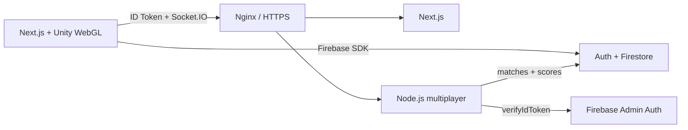

# Code Arena

Arena multijugador fullstack que integra Unity WebGL, Next.js, Firebase y un servidor Socket.IO autenticado. Dos jugadores crean o comparten una sala, se mueven en tiempo real, disputan una carrera hasta la meta y consultan resultados persistidos, ranking e historial.

## Flujo demostrable

1. Registro o login con Firebase Email/Password.
2. Lobby privado con salas Firestore en tiempo real.
3. Dos usuarios crean/se unen a una sala de cinco caracteres.
4. Unity WebGL recibe identidad y sala desde Next.js.
5. Socket.IO valida el Firebase ID Token y la membresía de la sala.
6. Ambos jugadores ven el movimiento remoto; el servidor valida secuencia, límites y velocidad.
7. El primero que alcanza el extremo derecho gana tres puntos.
8. Firebase Admin guarda la partida, actualiza puntajes y cierra la sala.
9. `/ranking` muestra clasificación global e historial privado.

## Arquitectura



| Capa | Tecnología |
|---|---|
| Juego | Unity 6000.3, WebGL, C#, `.jslib` y `postMessage` |
| Web | Next.js 16, React 19, TypeScript, Tailwind |
| Identidad/datos | Firebase Authentication y Cloud Firestore |
| Tiempo real | Node.js, Express, Socket.IO y Zod |
| Operación | Docker, Compose, Nginx, TLS y GitHub Actions |

## Estructura

- `code_arena/unity/ArenaMultiplayer`: proyecto y scripts Unity.
- `code_arena/web`: interfaz, autenticación, lobby, juego y ranking.
- `code_arena/server`: servidor autoritativo ligero y persistencia Admin.
- `code_arena/firebase`: reglas e índices Firestore.
- `code_arena/deployment`: Compose y Nginx HTTP/HTTPS.
- `code_arena/docs`: arquitectura, protocolo, pruebas y despliegue.

## Desarrollo local

Requisitos: Node.js 24, npm, proyecto Firebase configurado y, para persistir resultados, una cuenta de servicio local ignorada por Git.

```powershell
cd code_arena\web
Copy-Item .env.example .env.local
npm ci
npm run dev
```

```powershell
cd code_arena\server
$env:FIREBASE_PROJECT_ID='code-arena-daf7b'
$env:FIREBASE_SERVICE_ACCOUNT_PATH='firebase-adminsdk.local.json'
$env:CORS_ORIGIN='http://localhost:3000,http://localhost:3001'
npm ci
npm run dev
```

Las variables públicas Firebase pertenecen al SDK Web; no sustituyen una credencial administrativa. Nunca se versionan contraseñas, ID tokens, archivos `.env.local` ni JSON de cuenta de servicio.

## Calidad

```powershell
cd code_arena\server
npm run typecheck
npm test
npm run build
npm audit --audit-level=high

cd ..\web
npm run lint
npm run build
npm audit --audit-level=high
```

GitHub Actions repite estas comprobaciones y construye ambas imágenes Docker en cada cambio de `main` o pull request relevante.

## Documentación

- [Arquitectura](code_arena/docs/ARCHITECTURE.md)
- [Firebase y seguridad](code_arena/docs/FIREBASE_SETUP.md)
- [Protocolo multijugador](code_arena/docs/MULTIPLAYER_PROTOCOL.md)
- [Pruebas](code_arena/docs/TESTING.md)
- [Despliegue Docker, Nginx y HTTPS](code_arena/docs/DEPLOYMENT.md)
- [Estado del proyecto](code_arena/docs/PROJECT_STATUS.md)
